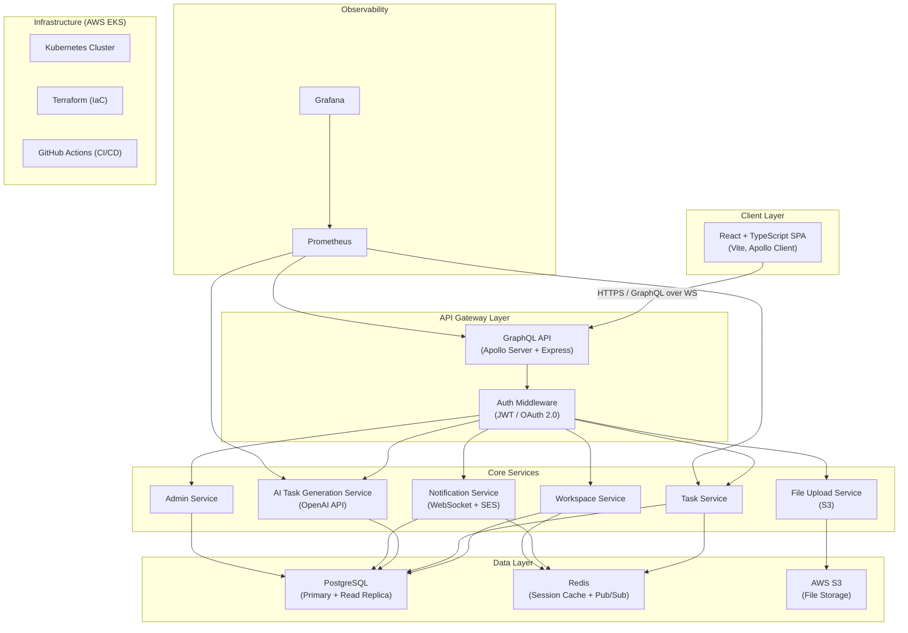
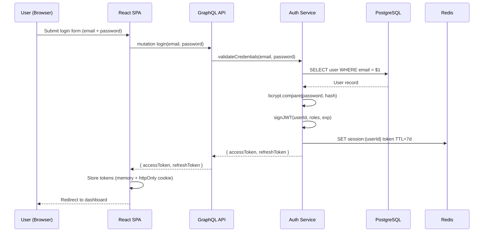
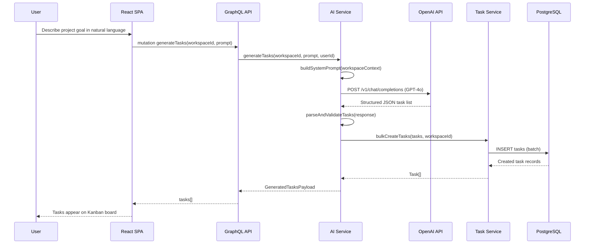
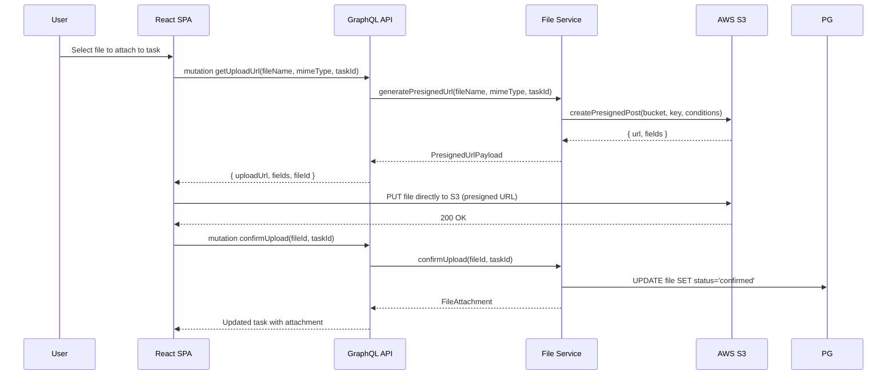

# Design Document: AI-Powered Project Management Platform

## Overview

The AI-Powered Project Management Platform is a full-stack, cloud-native application that enables teams to plan, track, and deliver projects with AI assistance. It combines a React/TypeScript frontend, a Node.js/Express/GraphQL backend, PostgreSQL persistence, and AWS cloud infrastructure to provide workspaces, Kanban boards, AI-generated tasks via OpenAI, file uploads via S3, real-time notifications, admin tooling, and observability through Prometheus and Grafana.

The platform is designed for horizontal scalability: all services run in Docker containers orchestrated by Kubernetes on AWS (EKS), infrastructure is provisioned with Terraform, and deployments are automated through GitHub Actions CI/CD pipelines. Authentication is handled via JWT for API access and OAuth 2.0 for third-party identity providers.

The AI layer augments the human workflow: users describe goals in natural language and the system decomposes them into actionable tasks, assigns priorities, and places them on the board — reducing planning overhead and keeping teams focused on execution.

---

## Architecture



---

## Sequence Diagrams

### User Authentication Flow



### AI Task Generation Flow



### File Upload Flow



---

## Components and Interfaces

### Component 1: GraphQL API Gateway (Apollo Server + Express)

**Purpose**: Single entry point for all client requests; enforces authentication, rate limiting, and routes to downstream services.

**Interface**:
```typescript
// GraphQL schema root types
type Query {
  me: User
  workspace(id: ID!): Workspace
  workspaces: [Workspace!]!
  task(id: ID!): Task
  tasks(workspaceId: ID!, filter: TaskFilter): [Task!]!
  adminStats: AdminStats
}

type Mutation {
  login(email: String!, password: String!): AuthPayload!
  register(input: RegisterInput!): AuthPayload!
  refreshToken(token: String!): AuthPayload!
  logout: Boolean!

  createWorkspace(input: CreateWorkspaceInput!): Workspace!
  updateWorkspace(id: ID!, input: UpdateWorkspaceInput!): Workspace!
  deleteWorkspace(id: ID!): Boolean!
  inviteMember(workspaceId: ID!, email: String!, role: MemberRole!): WorkspaceMember!

  createTask(input: CreateTaskInput!): Task!
  updateTask(id: ID!, input: UpdateTaskInput!): Task!
  moveTask(id: ID!, status: TaskStatus!, position: Int!): Task!
  deleteTask(id: ID!): Boolean!
  generateTasks(workspaceId: ID!, prompt: String!): GeneratedTasksPayload!

  getUploadUrl(input: UploadUrlInput!): PresignedUrlPayload!
  confirmUpload(fileId: ID!, taskId: ID!): FileAttachment!
}

type Subscription {
  taskUpdated(workspaceId: ID!): Task!
  notificationReceived: Notification!
}
```

**Responsibilities**:
- Parse and validate all GraphQL operations
- Enforce JWT authentication via context middleware
- Delegate to service modules by resolver
- Provide real-time subscriptions via WebSocket

---

### Component 2: Auth Service

**Purpose**: Manages user identity, credential validation, JWT issuance, and OAuth token exchange.

**Interface**:
```typescript
interface AuthService {
  register(input: RegisterInput): Promise<AuthPayload>
  login(email: string, password: string): Promise<AuthPayload>
  refreshAccessToken(refreshToken: string): Promise<AuthPayload>
  logout(userId: string): Promise<void>
  validateToken(token: string): Promise<JWTPayload>
  exchangeOAuthCode(provider: OAuthProvider, code: string): Promise<AuthPayload>
  hashPassword(password: string): Promise<string>
  verifyPassword(password: string, hash: string): Promise<boolean>
}

interface JWTPayload {
  sub: string        // userId
  email: string
  roles: UserRole[]
  workspaces: string[]
  iat: number
  exp: number
}

interface AuthPayload {
  accessToken: string
  refreshToken: string
  user: User
}
```

**Responsibilities**:
- Hash and verify passwords with bcrypt (cost factor ≥ 12)
- Sign JWTs with RS256 using rotating key pairs
- Manage refresh token lifecycle in Redis
- Handle OAuth 2.0 PKCE flow with Google/GitHub

---

### Component 3: Workspace Service

**Purpose**: Manages team workspaces, membership, roles, and workspace-scoped settings.

**Interface**:
```typescript
interface WorkspaceService {
  createWorkspace(userId: string, input: CreateWorkspaceInput): Promise<Workspace>
  getWorkspace(id: string, requesterId: string): Promise<Workspace>
  listUserWorkspaces(userId: string): Promise<Workspace[]>
  updateWorkspace(id: string, input: UpdateWorkspaceInput, requesterId: string): Promise<Workspace>
  deleteWorkspace(id: string, requesterId: string): Promise<void>
  inviteMember(workspaceId: string, email: string, role: MemberRole, inviterId: string): Promise<WorkspaceMember>
  removeMember(workspaceId: string, memberId: string, requesterId: string): Promise<void>
  updateMemberRole(workspaceId: string, memberId: string, role: MemberRole, requesterId: string): Promise<WorkspaceMember>
  getMemberPermissions(workspaceId: string, userId: string): Promise<Permission[]>
}

type MemberRole = 'OWNER' | 'ADMIN' | 'MEMBER' | 'VIEWER'
```

**Responsibilities**:
- Enforce RBAC for all workspace operations
- Send invitation emails via Notification Service
- Audit-log all membership changes

---

### Component 4: Task Service

**Purpose**: Full lifecycle management of tasks including Kanban board ordering.

**Interface**:
```typescript
interface TaskService {
  createTask(input: CreateTaskInput, creatorId: string): Promise<Task>
  getTask(id: string, requesterId: string): Promise<Task>
  listTasks(workspaceId: string, filter: TaskFilter, requesterId: string): Promise<Task[]>
  updateTask(id: string, input: UpdateTaskInput, requesterId: string): Promise<Task>
  moveTask(id: string, status: TaskStatus, position: number, requesterId: string): Promise<Task>
  deleteTask(id: string, requesterId: string): Promise<void>
  bulkCreateTasks(tasks: CreateTaskInput[], workspaceId: string): Promise<Task[]>
  reorderTasks(workspaceId: string, status: TaskStatus, orderedIds: string[]): Promise<Task[]>
}

type TaskStatus = 'BACKLOG' | 'TODO' | 'IN_PROGRESS' | 'IN_REVIEW' | 'DONE'
type TaskPriority = 'CRITICAL' | 'HIGH' | 'MEDIUM' | 'LOW'
```

**Responsibilities**:
- Validate task ownership and workspace membership
- Maintain deterministic board ordering via fractional indexing
- Publish task change events to Redis pub/sub for real-time subscriptions
- Support batch inserts for AI-generated tasks

---

### Component 5: AI Task Generation Service

**Purpose**: Converts natural language project goals into structured, actionable tasks using OpenAI GPT-4o.

**Interface**:
```typescript
interface AIService {
  generateTasks(workspaceId: string, prompt: string, userId: string): Promise<GeneratedTasksPayload>
  buildSystemPrompt(context: WorkspaceContext): string
  parseTasksFromResponse(raw: string): ParsedTask[]
  validateGeneratedTasks(tasks: ParsedTask[]): ValidationResult
}

interface GeneratedTasksPayload {
  tasks: Task[]
  tokensUsed: number
  model: string
  promptSummary: string
}

interface ParsedTask {
  title: string
  description: string
  priority: TaskPriority
  estimatedHours: number
  tags: string[]
  dependencies: string[]   // task titles that must precede this one
}
```

**Responsibilities**:
- Build context-aware system prompts from workspace metadata
- Parse and validate structured JSON from OpenAI responses
- Enforce task count limits (max 50 per generation request)
- Record token usage for cost tracking and rate limiting

---

### Component 6: File Upload Service

**Purpose**: Generates S3 presigned URLs for direct client-to-S3 uploads and manages file metadata.

**Interface**:
```typescript
interface FileService {
  generatePresignedUrl(input: UploadUrlInput): Promise<PresignedUrlPayload>
  confirmUpload(fileId: string, taskId: string, userId: string): Promise<FileAttachment>
  deleteFile(fileId: string, userId: string): Promise<void>
  getFileAttachments(taskId: string): Promise<FileAttachment[]>
}

interface UploadUrlInput {
  fileName: string
  mimeType: string
  taskId: string
  sizeBytes: number
}

interface PresignedUrlPayload {
  uploadUrl: string
  fields: Record<string, string>
  fileId: string
  expiresAt: Date
}
```

**Responsibilities**:
- Enforce file size limits (max 100MB per file)
- Validate MIME types against allowlist
- Generate unique S3 object keys with path scoping per workspace
- Clean up orphaned file records for unconfirmed uploads after 24h

---

### Component 7: Notification Service

**Purpose**: Delivers in-app real-time notifications and email notifications for task assignments, mentions, and system events.

**Interface**:
```typescript
interface NotificationService {
  sendNotification(userId: string, notification: CreateNotificationInput): Promise<Notification>
  broadcastToWorkspace(workspaceId: string, event: WorkspaceEvent): Promise<void>
  markAsRead(notificationId: string, userId: string): Promise<Notification>
  listNotifications(userId: string, unreadOnly: boolean): Promise<Notification[]>
  sendEmail(to: string, template: EmailTemplate, data: Record<string, unknown>): Promise<void>
}

type NotificationType = 'TASK_ASSIGNED' | 'TASK_MENTIONED' | 'TASK_COMPLETED' | 'WORKSPACE_INVITED' | 'AI_TASKS_GENERATED' | 'FILE_UPLOADED'
```

**Responsibilities**:
- Push real-time events over GraphQL subscriptions via Redis pub/sub
- Queue transactional emails through AWS SES
- Aggregate notification counts for badge display
- Respect user notification preferences

---

## Data Models

### Model: User

```typescript
interface User {
  id: string                    // UUID v4
  email: string                 // unique, lowercase, max 320 chars
  displayName: string           // 2–100 chars
  avatarUrl: string | null
  passwordHash: string | null   // null for OAuth-only accounts
  oauthProviders: OAuthProvider[]
  roles: UserRole[]             // platform-level roles
  isActive: boolean
  lastLoginAt: Date | null
  createdAt: Date
  updatedAt: Date
}

type UserRole = 'USER' | 'ADMIN' | 'SUPER_ADMIN'
type OAuthProvider = { provider: 'google' | 'github'; providerId: string }
```

**Validation Rules**:
- `email` must match RFC 5321, unique across all users
- `passwordHash` required unless at least one OAuth provider is linked
- `displayName` min 2, max 100 characters

---

### Model: Workspace

```typescript
interface Workspace {
  id: string
  name: string              // 2–80 chars, unique per owner
  slug: string              // URL-safe, auto-derived from name
  description: string | null
  ownerId: string           // FK → User.id
  members: WorkspaceMember[]
  settings: WorkspaceSettings
  isArchived: boolean
  createdAt: Date
  updatedAt: Date
}

interface WorkspaceMember {
  userId: string
  workspaceId: string
  role: MemberRole
  joinedAt: Date
}

interface WorkspaceSettings {
  allowPublicInvites: boolean
  defaultTaskPriority: TaskPriority
  aiGenerationEnabled: boolean
  maxFileUploadMb: number       // default: 100
}
```

---

### Model: Task

```typescript
interface Task {
  id: string
  workspaceId: string
  title: string               // 1–200 chars
  description: string | null  // markdown, max 10,000 chars
  status: TaskStatus
  priority: TaskPriority
  position: number            // fractional index for ordering within column
  assigneeId: string | null   // FK → User.id
  creatorId: string           // FK → User.id
  dueDate: Date | null
  estimatedHours: number | null
  tags: string[]
  attachments: FileAttachment[]
  aiGenerated: boolean
  aiPromptId: string | null   // reference to the generation request
  createdAt: Date
  updatedAt: Date
}
```

---

### Model: FileAttachment

```typescript
interface FileAttachment {
  id: string
  taskId: string
  workspaceId: string
  uploadedById: string
  fileName: string
  mimeType: string
  sizeBytes: number
  s3Key: string
  s3Bucket: string
  status: 'PENDING' | 'CONFIRMED' | 'DELETED'
  url: string               // presigned GET URL, regenerated on access
  uploadedAt: Date
}
```

---

### Model: Notification

```typescript
interface Notification {
  id: string
  userId: string             // recipient
  type: NotificationType
  title: string
  body: string
  actionUrl: string | null
  isRead: boolean
  metadata: Record<string, unknown>
  createdAt: Date
}
```

---

### Model: AIPromptRecord

```typescript
interface AIPromptRecord {
  id: string
  workspaceId: string
  requestedById: string
  prompt: string
  model: string              // e.g. "gpt-4o"
  tokensPrompt: number
  tokensCompletion: number
  tasksGenerated: number
  status: 'PENDING' | 'SUCCESS' | 'FAILED'
  errorMessage: string | null
  createdAt: Date
}
```

---

## Algorithmic Pseudocode

### Algorithm 1: JWT Authentication Middleware

```typescript
async function authMiddleware(req: Request, res: Response, next: NextFunction): Promise<void> {
  // Precondition: req.headers.authorization may or may not exist
  const authHeader = req.headers.authorization
  
  if (!authHeader || !authHeader.startsWith('Bearer ')) {
    req.user = null
    return next()
  }

  const token = authHeader.slice(7)

  try {
    // Verify signature using RS256 public key
    const payload = jwt.verify(token, PUBLIC_KEY, { algorithms: ['RS256'] }) as JWTPayload
    
    // Check token not revoked in Redis
    const isRevoked = await redis.get(`revoked:${payload.sub}:${payload.iat}`)
    if (isRevoked) {
      throw new AuthenticationError('Token has been revoked')
    }

    req.user = payload
    next()
  } catch (err) {
    if (err instanceof jwt.TokenExpiredError) {
      throw new AuthenticationError('Token expired')
    }
    throw new AuthenticationError('Invalid token')
  }
  // Postcondition: req.user is set to JWTPayload or null (public routes)
}
```

**Preconditions:**
- `PUBLIC_KEY` is loaded at startup from AWS Secrets Manager
- Redis connection is available

**Postconditions:**
- `req.user` is a valid `JWTPayload` if token is present, valid, and not revoked
- `req.user` is `null` if no Authorization header is present
- Throws `AuthenticationError` for invalid, expired, or revoked tokens

---

### Algorithm 2: AI Task Generation

```typescript
async function generateTasks(
  workspaceId: string,
  prompt: string,
  userId: string
): Promise<GeneratedTasksPayload> {
  // Precondition: workspaceId is valid, user is workspace member, prompt is non-empty
  
  // 1. Load workspace context for prompt enrichment
  const workspace = await workspaceRepo.findById(workspaceId)
  const existingTasks = await taskRepo.listTitles(workspaceId, { limit: 20 })
  const members = await workspaceRepo.listMembers(workspaceId)

  // 2. Build system prompt with context
  const systemPrompt = buildSystemPrompt({
    workspaceName: workspace.name,
    existingTasks,
    memberCount: members.length,
    settings: workspace.settings
  })

  // 3. Prepare messages
  const messages: ChatMessage[] = [
    { role: 'system', content: systemPrompt },
    { role: 'user', content: prompt }
  ]

  // 4. Call OpenAI with structured output
  const response = await openai.chat.completions.create({
    model: 'gpt-4o',
    messages,
    response_format: { type: 'json_object' },
    max_tokens: 4096,
    temperature: 0.3
  })

  // 5. Parse and validate response
  const rawContent = response.choices[0].message.content ?? '{}'
  const parsed = JSON.parse(rawContent) as { tasks: ParsedTask[] }
  const validation = validateGeneratedTasks(parsed.tasks)

  if (!validation.isValid) {
    throw new AIGenerationError(`Invalid task structure: ${validation.errors.join(', ')}`)
  }

  // 6. Enforce limits: max 50 tasks per generation
  const tasksToCreate = parsed.tasks.slice(0, 50)

  // 7. Record the prompt for cost tracking
  const promptRecord = await aiPromptRepo.create({
    workspaceId, requestedById: userId, prompt,
    model: 'gpt-4o',
    tokensPrompt: response.usage?.prompt_tokens ?? 0,
    tokensCompletion: response.usage?.completion_tokens ?? 0,
    tasksGenerated: tasksToCreate.length,
    status: 'SUCCESS'
  })

  // 8. Bulk create tasks in database
  const createInputs: CreateTaskInput[] = tasksToCreate.map(t => ({
    workspaceId,
    title: t.title,
    description: t.description,
    priority: t.priority,
    estimatedHours: t.estimatedHours,
    tags: t.tags,
    aiGenerated: true,
    aiPromptId: promptRecord.id,
    status: 'BACKLOG' as TaskStatus,
    creatorId: userId
  }))

  const tasks = await taskService.bulkCreateTasks(createInputs, workspaceId)

  return {
    tasks,
    tokensUsed: (response.usage?.total_tokens ?? 0),
    model: 'gpt-4o',
    promptSummary: prompt.slice(0, 200)
  }
  // Postcondition: tasks are persisted in DB, prompt record saved, tasks.length <= 50
}
```

**Preconditions:**
- `workspaceId` resolves to an existing, non-archived workspace
- `userId` is an active member of the workspace with at least `MEMBER` role
- `prompt` is a non-empty string (max 2000 chars)
- OpenAI API key is configured and valid

**Postconditions:**
- All generated tasks are persisted with `aiGenerated: true`
- `AIPromptRecord` is saved regardless of downstream errors
- Returned `tasks.length` is between 0 and 50 (inclusive)
- Token usage is recorded for billing/cost tracking

**Loop Invariants:**
- For each task in `tasksToCreate`: `task.workspaceId === workspaceId` and `task.aiGenerated === true`

---

### Algorithm 3: Kanban Task Reordering (Fractional Indexing)

```typescript
function computeNewPosition(
  tasks: Task[],
  targetStatus: TaskStatus,
  insertAfterIndex: number   // -1 means insert at top
): number {
  // Precondition: tasks is sorted ascending by position within targetStatus
  const columnTasks = tasks
    .filter(t => t.status === targetStatus)
    .sort((a, b) => a.position - b.position)

  if (columnTasks.length === 0) {
    return 1.0   // first item in empty column
  }

  if (insertAfterIndex === -1) {
    // Insert before first item
    return columnTasks[0].position / 2
  }

  if (insertAfterIndex >= columnTasks.length - 1) {
    // Insert after last item
    return columnTasks[columnTasks.length - 1].position + 1.0
  }

  // Insert between two items
  const before = columnTasks[insertAfterIndex].position
  const after = columnTasks[insertAfterIndex + 1].position
  const mid = (before + after) / 2

  // Detect precision exhaustion: if difference < epsilon, rebalance
  const EPSILON = 1e-10
  if (after - before < EPSILON) {
    return rebalancePositions(columnTasks)  // reassign 1.0, 2.0, 3.0, ...
  }

  return mid
  // Postcondition: returned position satisfies before < result < after
}
```

**Preconditions:**
- `tasks` is a non-empty array of Task objects within the same workspace
- `insertAfterIndex` is in range `[-1, columnTasks.length - 1]`

**Postconditions:**
- Returned position value places the task correctly between neighbors
- If column is empty, returns `1.0`
- If precision exhaustion is detected, positions are rebalanced as integers

**Loop Invariants:**
- During rebalancing: each task at index `i` receives position `i + 1`, maintaining sort order

---

### Algorithm 4: RBAC Permission Check

```typescript
async function assertPermission(
  userId: string,
  workspaceId: string,
  requiredPermission: Permission
): Promise<void> {
  // Precondition: userId and workspaceId are non-empty strings
  
  const member = await workspaceRepo.getMember(workspaceId, userId)

  if (!member) {
    throw new ForbiddenError('User is not a member of this workspace')
  }

  const rolePermissions = ROLE_PERMISSION_MAP[member.role]

  if (!rolePermissions.includes(requiredPermission)) {
    throw new ForbiddenError(
      `Role '${member.role}' does not have permission '${requiredPermission}'`
    )
  }
  // Postcondition: function returns void if permitted, throws ForbiddenError otherwise
}

// Role-permission matrix
const ROLE_PERMISSION_MAP: Record<MemberRole, Permission[]> = {
  OWNER:  ['read', 'write', 'delete', 'manage_members', 'manage_settings', 'manage_billing'],
  ADMIN:  ['read', 'write', 'delete', 'manage_members'],
  MEMBER: ['read', 'write'],
  VIEWER: ['read']
}
```

---

## Key Functions with Formal Specifications

### `login(email, password): Promise<AuthPayload>`

```typescript
async function login(email: string, password: string): Promise<AuthPayload>
```

**Preconditions:**
- `email` is a non-empty, syntactically valid email address
- `password` is a non-empty string (min 8 chars enforced at registration)
- Database connection is available

**Postconditions:**
- Returns `AuthPayload` containing `accessToken` (15min TTL) and `refreshToken` (7d TTL) if credentials are valid
- Throws `AuthenticationError('Invalid credentials')` if user not found or password does not match
- On success: `lastLoginAt` is updated in the database
- `refreshToken` is stored in Redis with `SET session:{userId} {token} EX 604800`

---

### `moveTask(id, status, position, requesterId): Promise<Task>`

```typescript
async function moveTask(
  id: string,
  status: TaskStatus,
  position: number,
  requesterId: string
): Promise<Task>
```

**Preconditions:**
- `id` refers to an existing, non-deleted task
- `requesterId` has at least `MEMBER` role in the task's workspace
- `status` is a valid `TaskStatus` value
- `position` is a positive finite number

**Postconditions:**
- Task's `status` and `position` fields are updated atomically
- A `TASK_MOVED` event is published to Redis pub/sub channel `workspace:{workspaceId}:tasks`
- All other task fields remain unchanged
- `updatedAt` is refreshed to the current timestamp

---

### `generatePresignedUrl(input): Promise<PresignedUrlPayload>`

```typescript
async function generatePresignedUrl(input: UploadUrlInput): Promise<PresignedUrlPayload>
```

**Preconditions:**
- `input.sizeBytes` ≤ `workspace.settings.maxFileUploadMb * 1024 * 1024`
- `input.mimeType` is in the allowed MIME types list
- `input.taskId` refers to an existing task the user has `write` access to

**Postconditions:**
- Returns a presigned POST URL valid for exactly 15 minutes
- A `FileAttachment` record is created with `status: 'PENDING'`
- The S3 key follows the pattern `workspaces/{workspaceId}/tasks/{taskId}/{fileId}/{fileName}`
- Pending files not confirmed within 24h are scheduled for cleanup

---

### `validateGeneratedTasks(tasks): ValidationResult`

```typescript
function validateGeneratedTasks(tasks: ParsedTask[]): ValidationResult
```

**Preconditions:**
- `tasks` is an array (may be empty)

**Postconditions:**
- Returns `{ isValid: true, errors: [] }` if all tasks pass all rules
- Returns `{ isValid: false, errors: string[] }` listing all violations if any task fails
- Validation rules checked: title non-empty and ≤200 chars, priority is valid enum value, estimatedHours is non-negative, tags is array of strings
- Does not mutate the input array

---

## Example Usage

### Frontend: Creating a Task

```typescript
// Apollo Client mutation
const CREATE_TASK = gql`
  mutation CreateTask($input: CreateTaskInput!) {
    createTask(input: $input) {
      id
      title
      status
      priority
      position
      assignee { id displayName avatarUrl }
      createdAt
    }
  }
`

function CreateTaskForm({ workspaceId }: { workspaceId: string }) {
  const [createTask, { loading }] = useMutation(CREATE_TASK)

  const handleSubmit = async (values: TaskFormValues) => {
    await createTask({
      variables: {
        input: {
          workspaceId,
          title: values.title,
          description: values.description,
          priority: values.priority,
          assigneeId: values.assigneeId ?? null,
          dueDate: values.dueDate ?? null,
        }
      },
      // Optimistic update for instant UI feedback
      optimisticResponse: {
        createTask: {
          __typename: 'Task',
          id: `temp-${Date.now()}`,
          ...values,
          status: 'BACKLOG',
          position: 9999,
          assignee: null,
          createdAt: new Date().toISOString()
        }
      }
    })
  }

  return <TaskForm onSubmit={handleSubmit} loading={loading} />
}
```

### Backend: GraphQL Resolver with Auth Guard

```typescript
// Task resolver with permission enforcement
const taskResolvers = {
  Mutation: {
    createTask: async (
      _: unknown,
      { input }: { input: CreateTaskInput },
      context: GraphQLContext
    ): Promise<Task> => {
      // Guard: must be authenticated
      if (!context.user) {
        throw new AuthenticationError('Must be logged in')
      }

      // Guard: must be workspace member with write access
      await assertPermission(context.user.sub, input.workspaceId, 'write')

      return taskService.createTask(input, context.user.sub)
    },

    generateTasks: async (
      _: unknown,
      { workspaceId, prompt }: { workspaceId: string; prompt: string },
      context: GraphQLContext
    ): Promise<GeneratedTasksPayload> => {
      if (!context.user) throw new AuthenticationError('Must be logged in')
      
      await assertPermission(context.user.sub, workspaceId, 'write')

      // Rate limit: 10 AI requests per workspace per hour
      const rateLimitKey = `ai:ratelimit:${workspaceId}`
      const count = await redis.incr(rateLimitKey)
      if (count === 1) await redis.expire(rateLimitKey, 3600)
      if (count > 10) {
        throw new UserInputError('AI generation rate limit exceeded. Try again later.')
      }

      return aiService.generateTasks(workspaceId, prompt, context.user.sub)
    }
  }
}
```

### Infrastructure: Kubernetes Deployment Manifest (abbreviated)

```yaml
# k8s/deployments/api-server.yaml
apiVersion: apps/v1
kind: Deployment
metadata:
  name: api-server
  namespace: production
spec:
  replicas: 3
  selector:
    matchLabels:
      app: api-server
  template:
    spec:
      containers:
        - name: api-server
          image: your-ecr-repo/api-server:latest
          ports:
            - containerPort: 4000
          env:
            - name: DATABASE_URL
              valueFrom:
                secretKeyRef:
                  name: db-credentials
                  key: url
            - name: OPENAI_API_KEY
              valueFrom:
                secretKeyRef:
                  name: openai-credentials
                  key: api-key
          resources:
            requests:
              memory: "256Mi"
              cpu: "250m"
            limits:
              memory: "512Mi"
              cpu: "500m"
          livenessProbe:
            httpGet:
              path: /health
              port: 4000
            initialDelaySeconds: 30
            periodSeconds: 10
```

---

## Correctness Properties

The following properties must hold at all times across the system:

**P1 — Authentication Completeness**: For all requests `r` accessing a protected resolver, if `r.user` is null then the resolver throws `AuthenticationError` before any data access occurs.

**P2 — RBAC Soundness**: For all operations `op` requiring permission `p`, if `getMemberRole(userId, workspaceId)` does not include `p` in `ROLE_PERMISSION_MAP`, then `op` throws `ForbiddenError` and no mutation is applied.

**P3 — AI Task Bound**: For all calls to `generateTasks(workspaceId, prompt, userId)`, the number of tasks persisted satisfies `0 ≤ tasks.length ≤ 50`.

**P4 — Board Ordering Consistency**: For all tasks in a workspace column sorted by `position`, no two tasks share the same position value after any `moveTask` or `reorderTasks` operation.

**P5 — File Upload Safety**: For all calls to `getUploadUrl`, the returned presigned URL is scoped to a single S3 key, expires within 15 minutes, and enforces the content-length-range condition matching `input.sizeBytes`.

**P6 — Token Integrity**: For all `accessToken` values issued by `login` or `refreshToken`, `jwt.verify(token, PUBLIC_KEY)` succeeds if and only if the token was signed by the server's private key, is within its expiry window, and has not been revoked.

**P7 — Password Security**: For all user accounts with password-based auth, the stored value of `passwordHash` is the result of `bcrypt.hash(password, 12)` and the plaintext password is never persisted or logged.

**P8 — Workspace Data Isolation**: For all queries returning tasks, files, or members, the result set contains only records where `workspaceId` matches a workspace the requesting user belongs to.

---

## Error Handling

### Scenario 1: OpenAI API Unavailable

**Condition**: OpenAI API returns 5xx or times out during task generation
**Response**: `AIGenerationError` is thrown with message "AI service temporarily unavailable". The `AIPromptRecord` is saved with `status: 'FAILED'` and the error message.
**Recovery**: Client retries are allowed up to 3 times with exponential backoff (1s, 2s, 4s). The workspace rate limit counter is not incremented for failed requests.

### Scenario 2: JWT Token Expired

**Condition**: Client sends a request with an expired `accessToken`
**Response**: GraphQL response includes error with code `UNAUTHENTICATED`. The client intercepts this and automatically calls `refreshToken` mutation using the `httpOnly` cookie-stored refresh token.
**Recovery**: On successful refresh, the original request is retried with the new access token transparently to the user.

### Scenario 3: S3 Upload Fails After Presigned URL Issued

**Condition**: Client obtains a presigned URL but the PUT to S3 fails or is abandoned
**Response**: `FileAttachment` remains in `PENDING` status. The `confirmUpload` mutation is never called.
**Recovery**: A scheduled job (AWS Lambda or Kubernetes CronJob) runs every hour to delete `PENDING` files older than 24 hours from both S3 and the database.

### Scenario 4: Database Connection Pool Exhausted

**Condition**: PostgreSQL connection pool is at capacity under high load
**Response**: New queries queue for up to 5 seconds, then reject with a 503 response. Prometheus alert fires when pool utilization exceeds 80%.
**Recovery**: Kubernetes HPA scales the API server pods. PgBouncer sits between the API and PostgreSQL to multiplex connections.

### Scenario 5: Unauthorized Workspace Access Attempt

**Condition**: User requests data from a workspace they are not a member of
**Response**: `ForbiddenError` is thrown. The GraphQL response returns a generic "Access denied" message. The attempt is logged with the user ID, workspace ID, and timestamp for audit.
**Recovery**: No recovery needed — this is expected behavior for access control enforcement.

---

## Testing Strategy

### Unit Testing Approach

Each service module is unit-tested in isolation with mocked dependencies (database repositories, Redis client, OpenAI client, S3 client). Key test areas:

- Auth service: password hashing/verification, JWT signing/verification, refresh token rotation
- AI service: prompt building, response parsing, task validation, error handling for malformed OpenAI responses
- Task service: RBAC enforcement, fractional indexing correctness, bulk create idempotency
- File service: MIME type validation, size limit enforcement, S3 key generation

### Property-Based Testing Approach

**Property Test Library**: `fast-check` (TypeScript)

Key properties to test with generated inputs:

```typescript
// P4: Board ordering is always consistent after any sequence of moves
fc.assert(
  fc.property(
    fc.array(fc.record({ id: fc.uuid(), position: fc.float({ min: 0, max: 1000 }) })),
    fc.integer({ min: -1, max: 99 }),
    (tasks, insertAfterIndex) => {
      const newPos = computeNewPosition(tasks, 'TODO', insertAfterIndex)
      const sorted = [...tasks, { position: newPos }].sort((a, b) => a.position - b.position)
      // No duplicate positions
      const positions = sorted.map(t => t.position)
      return new Set(positions).size === positions.length
    }
  )
)

// P3: AI task generation never returns more than 50 tasks
fc.assert(
  fc.property(
    fc.array(fc.record({ title: fc.string(), priority: fc.constantFrom('HIGH','MEDIUM','LOW') }), { maxLength: 200 }),
    (rawTasks) => {
      const result = rawTasks.slice(0, 50)
      return result.length <= 50
    }
  )
)
```

### Integration Testing Approach

End-to-end flows tested against a real PostgreSQL + Redis test instance (Docker Compose):
- Full auth flow: register → login → access protected endpoint → token refresh → logout
- Task lifecycle: create → move across columns → assign → complete → delete
- AI generation: mock OpenAI response → validate task persistence → check prompt record
- File upload: get presigned URL → confirm upload → retrieve attachment → cleanup on delete

---

## Performance Considerations

- **Database indexing**: Composite indexes on `(workspaceId, status, position)` for Kanban queries; index on `(userId)` for notification lookups; partial index on `(status = 'PENDING', uploadedAt)` for file cleanup jobs.
- **Connection pooling**: PgBouncer in transaction mode pools up to 100 server connections; each API pod holds a pool of 10 client connections.
- **Redis caching**: Workspace membership is cached in Redis with a 5-minute TTL to avoid redundant `assertPermission` DB lookups on every request.
- **GraphQL query depth limiting**: Maximum query depth of 10 and query complexity of 1000 to prevent N+1 abuse and overly expensive operations.
- **DataLoader**: All GraphQL resolvers use DataLoader for batching and caching within a single request to eliminate N+1 queries.
- **AI rate limiting**: 10 AI generation requests per workspace per hour enforced via Redis counter to control OpenAI API costs.
- **Horizontal scaling**: Stateless API pods scale via Kubernetes HPA on CPU > 60%; target 3–10 replicas in production.

---

## Security Considerations

- **JWT with RS256**: Asymmetric signing ensures only the API server with the private key can issue tokens; all services can verify with the public key.
- **Refresh token rotation**: Each refresh token use issues a new refresh token and invalidates the old one; enables single-use refresh token security.
- **PKCE for OAuth**: OAuth 2.0 flows use PKCE (Proof Key for Code Exchange) to prevent authorization code interception attacks.
- **bcrypt cost factor 12**: Password hashing with bcrypt at cost 12 makes brute-force attacks computationally expensive.
- **S3 presigned URLs**: Files are never proxied through the API server; clients upload directly to S3 with short-lived signed URLs, keeping credentials out of application code.
- **Input validation**: All GraphQL inputs are validated with Zod schemas before reaching service layer; protects against injection and malformed data.
- **Rate limiting**: API-level rate limiting via `express-rate-limit` (100 req/15min per IP for auth endpoints, 1000 req/15min general); AI endpoint has workspace-scoped limits.
- **Secrets management**: All secrets (DB password, JWT private key, OpenAI API key) are stored in AWS Secrets Manager and injected as Kubernetes Secrets; never stored in code or environment files.
- **Container security**: All Docker images use non-root users; distroless base images where possible; Kubernetes `securityContext` enforces `readOnlyRootFilesystem`.
- **Network policies**: Kubernetes NetworkPolicies restrict pod-to-pod communication; only the API server can reach the database pods.

---

## Dependencies

### Frontend
| Package | Version | Purpose |
|---------|---------|---------|
| react | ^18.3 | UI framework |
| typescript | ^5.4 | Type safety |
| @apollo/client | ^3.10 | GraphQL client + caching |
| react-router-dom | ^6.23 | Client-side routing |
| @dnd-kit/core | ^6.1 | Drag-and-drop for Kanban |
| zustand | ^4.5 | Lightweight state management |
| zod | ^3.23 | Runtime input validation |
| tailwindcss | ^3.4 | Utility-first CSS |

### Backend
| Package | Version | Purpose |
|---------|---------|---------|
| express | ^4.19 | HTTP server |
| @apollo/server | ^4.10 | GraphQL server |
| graphql | ^16.8 | GraphQL runtime |
| typeorm | ^0.3.20 | PostgreSQL ORM |
| ioredis | ^5.3 | Redis client |
| jsonwebtoken | ^9.0 | JWT issuance and verification |
| bcrypt | ^5.1 | Password hashing |
| openai | ^4.52 | OpenAI API client |
| @aws-sdk/client-s3 | ^3.600 | S3 presigned URLs |
| @aws-sdk/s3-request-presigner | ^3.600 | S3 presigned URL generation |
| zod | ^3.23 | Input validation |
| prom-client | ^15.1 | Prometheus metrics |
| winston | ^3.13 | Structured logging |

### Infrastructure
| Tool | Version | Purpose |
|------|---------|---------|
| terraform | ~1.8 | Infrastructure as code (EKS, RDS, S3, SES) |
| docker | 26.x | Container build |
| kubernetes | 1.30 | Container orchestration |
| helm | 3.15 | Kubernetes package management |
| github-actions | N/A | CI/CD pipelines |
| prometheus | 2.52 | Metrics scraping |
| grafana | 11.x | Metrics dashboards and alerting |
